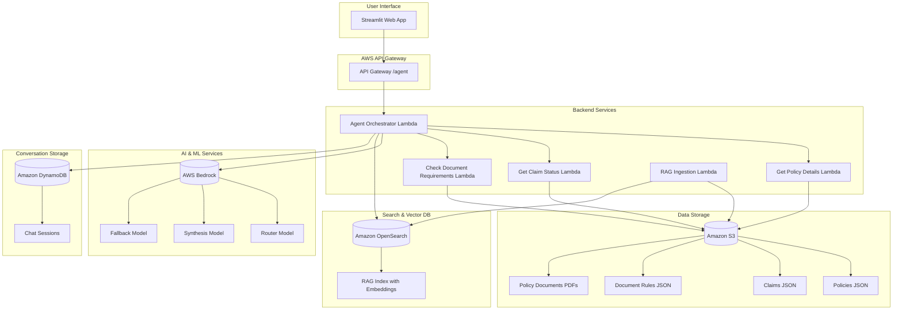
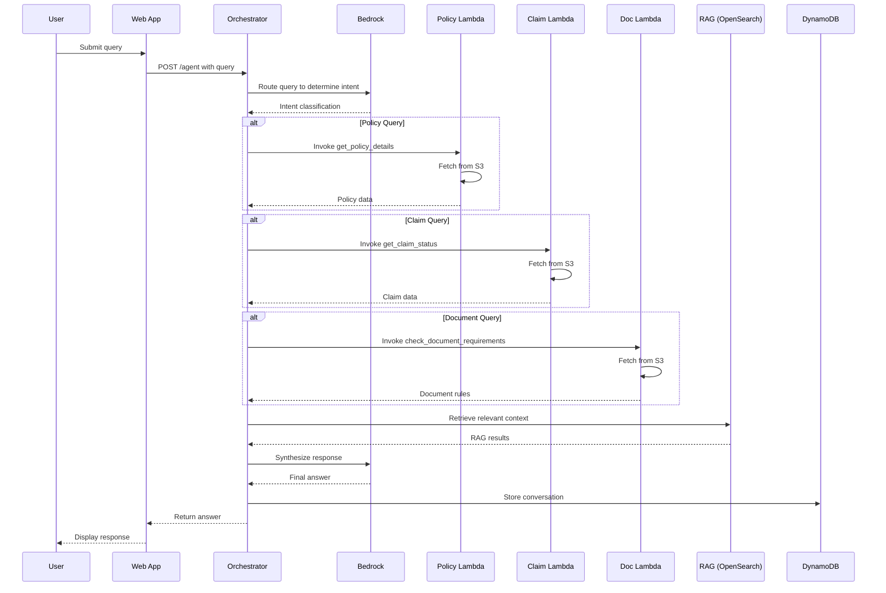

# NorthStar Insurance AI Agent

## 🤖 Project Overview

NorthStar Insurance AI Agent is an intelligent conversational assistant designed to help insurance customers and agents efficiently handle policy inquiries, claim status checks, and document requirements. Built on AWS serverless architecture, this agent leverages large language models (LLMs) through Amazon Bedrock, Retrieval-Augmented Generation (RAG) using OpenSearch, and a multi-agent orchestration system to provide accurate, context-aware responses.

The system processes natural language queries about insurance policies and claims, intelligently routing them to specialized Lambda functions that retrieve relevant data from Amazon S3, while using RAG to provide additional context from policy documents.

## ✨ Key Features

- **Intelligent Query Routing**: Automatically classifies user intent and routes queries to appropriate specialized functions
- **Policy Information Retrieval**: Access detailed policy information including coverage limits, deductibles, and customer details
- **Claim Status Tracking**: Real-time claim status updates and damage estimates
- **Document Requirements Checking**: Automated verification of required documents based on loss type
- **Retrieval-Augmented Generation (RAG)**: Enhanced responses using vector search on policy documents
- **Conversational Memory**: Persistent chat sessions stored in DynamoDB
- **Multi-Model Architecture**: Router, synthesis, and fallback models for robust AI responses
- **Serverless Deployment**: Fully managed AWS infrastructure with auto-scaling
- **Web Interface**: User-friendly Streamlit application for easy interaction

## 🏗️ Architecture

### System Architecture Diagram



### Query Processing Flow



## 🛠️ Technology Stack

### Backend & Infrastructure
- **AWS Lambda**: Serverless compute for all backend functions
- **Amazon API Gateway**: REST API endpoint management
- **AWS Serverless Application Model (SAM)**: Infrastructure as Code
- **Amazon S3**: Data storage for policies, claims, and documents
- **Amazon OpenSearch**: Vector database for RAG implementation
- **Amazon DynamoDB**: NoSQL database for conversation storage
- **Amazon Bedrock**: Managed AI/ML service for LLM access

### AI & ML
- **Router Model**: `amazon.nova-2-sonic-v1:0` - Classifies user intent
- **Synthesis Model**: `amazon.nova-2-sonic-v1:0` - Generates final responses
- **Fallback Model**: `amazon.nova-2-sonic-v1:0` - Backup for failed responses
- **Embedding Model**: `amazon.titan-embed-text-v2:0` - Text vectorization for RAG

### Frontend
- **Streamlit**: Python web application framework
- **Docker**: Containerization for web interface

### Data Processing
- **Python 3.12**: Primary programming language
- **Boto3**: AWS SDK for Python
- **Requests**: HTTP library for API calls
- **Faker**: Synthetic data generation

### Development & Deployment
- **GitHub Actions**: CI/CD pipeline
- **Docker**: Container orchestration
- **AWS SAM CLI**: Local development and testing

## 📁 Project Structure

```
├── Database_Generation/           # Synthetic data generation
│   ├── generate_data.py          # Main data generation script
│   ├── data/                     # Generated data files
│   │   ├── policies.json         # Insurance policy data
│   │   ├── document_rules.json   # Document requirements by loss type
│   │   └── claims/               # Individual claim JSON files
│   └── Insurance claims data.csv # Raw claims data
├── Documents/                    # Policy documents and manuals
├── Lambda_functions/             # AWS Lambda function code
│   ├── template.yaml             # SAM deployment template
│   ├── agent_orchestrator/       # Main agent orchestration logic
│   ├── get_policy_details/       # Policy information retrieval
│   ├── get_claim_status/         # Claim status checking
│   ├── check_document_requirements/ # Document requirements validation
│   └── rag_ingestion/            # Document ingestion for RAG
├── Web_interface/                # Streamlit web application
│   ├── app.py                    # Main web app
│   ├── requirements.txt          # Python dependencies
│   └── Dockerfile                # Docker container config
├── requirements.txt              # Project-wide Python dependencies
└── .env                          # Environment variables (AWS credentials, etc.)
```

## 🚀 Setup & Installation

### Prerequisites

- **Python 3.12** or higher
- **AWS CLI** configured with appropriate permissions
- **AWS SAM CLI** for local development
- **Docker** for containerized deployment
- **Git** for version control

### 1. Clone the Repository

```bash
git clone <repository-url>
cd northstar-insurance-ai-agent
```

### 2. Environment Configuration

Create a `.env` file in the root directory with the following variables:

```env
# AWS Credentials for GitHub Actions (Access Key and Secret Access Key)
AWS_ACCOUNT_ID=your-account-id
AWS_ACCESS_KEY=your-access-key
AWS_SECRET_ACCESS_KEY=your-secret-key
AWS_REGION=eu-north-1

# S3 Bucket and Folder Names
AWS_S3_BUCKET_NAME=your-bucket-name
AWS_INSURANCE_DATA=data
AWS_CLAIMS_DATA=claims

# AWS Bedrock Configuration
AWS_BEDROCK_ROUTER_MODEL=amazon.nova-2-sonic-v1:0
AWS_BEDROCK_SYNTH_MODEL=amazon.nova-2-sonic-v1:0
AWS_BEDROCK_FALLBACK_MODEL=amazon.nova-2-sonic-v1:0

# OpenSearch
OPENSEARCH_ENDPOINT=https://your-opensearch-endpoint
RAG_INDEX=insurance-rag-index

# API Settings
EC2_ELASTIC_IP=your-ec2-ip
AGENT_API=https://your-api-gateway-url/Prod/agent
CONVERSATION_TABLE=northstar-conversations
```

### 3. Install Dependencies

```bash
# Install project-wide dependencies
pip install -r requirements.txt

# Install web interface dependencies
cd Web_interface
pip install -r requirements.txt
cd ..
```

### 4. Generate Synthetic Data

```bash
cd Database_Generation
python generate_data.py
```

This will create:
- `data/policies.json`: 50 insurance policies
- `data/claims/`: 300 individual claim files
- `data/document_rules.json`: Document requirements mapping

### 5. Deploy AWS Infrastructure

```bash
cd Lambda_functions

# Build and deploy SAM application
sam build
sam deploy --guided
```

The deployment will create:
- Lambda functions for each service
- API Gateway with `/agent` endpoint
- DynamoDB table for conversations
- Required IAM roles and policies

## 🔧 Configuration

### AWS Services Setup

1. **S3 Bucket**: Create a bucket and upload the generated data files
2. **OpenSearch**: Set up an OpenSearch Serverless collection
3. **Bedrock**: Ensure access to required models
4. **DynamoDB**: Table created automatically by SAM
5. **API Gateway**: Endpoint URL provided after deployment

### Environment Variables

All configuration is managed through environment variables. Key settings:

- **Model Configuration**: Adjust `AWS_BEDROCK_*_MODEL` for different AI models
- **Data Paths**: Modify `AWS_INSURANCE_DATA` and `AWS_CLAIMS_DATA` for different S3 prefixes
- **RAG Settings**: Configure `RAG_INDEX` and `OPENSEARCH_ENDPOINT` for search functionality

## 📖 Usage

### Web Interface

1. Start the Streamlit application:

```bash
cd Web_interface
streamlit run app.py
```

2. Open your browser to `http://localhost:8501`
3. Start chatting with the insurance agent

### API Usage

The agent exposes a REST API endpoint:

```bash
curl -X POST https://your-api-gateway-url/Prod/agent \
  -H "Content-Type: application/json" \
  -d '{
    "query": "What is the status of claim CLM-003C7AFB?",
    "session_id": "optional-session-id"
  }'
```

**Response Format:**
```json
{
  "answer": "Claim CLM-003C7AFB is currently submitted with an estimated damage of $14,089.",
  "session_id": "generated-or-provided-session-id"
}
```

### Sample Queries

The agent can handle various types of insurance-related queries:

- **Policy Information**: "Show me the details for policy AUTO-10019"
- **Claim Status**: "What's the status of my claim CLM-003C7AFB?"
- **Document Requirements**: "What documents do I need for a car collision claim?"
- **Coverage Questions**: "Does my home policy cover water damage?"
- **General Assistance**: "How do I file a new claim?"

## 🔄 Data Flow

1. **User Query**: Submitted through web interface or API
2. **Intent Classification**: Router model determines query type
3. **Data Retrieval**: Specialized Lambda functions fetch relevant data from S3
4. **Context Enhancement**: RAG system retrieves related information from policy documents
5. **Response Synthesis**: Synthesis model generates natural language response
6. **Conversation Storage**: Chat history saved to DynamoDB for continuity

## 🧪 Testing

### Local Testing

```bash
# Test Lambda functions locally
cd Lambda_functions
sam local invoke AgentOrchestratorFunction -e event.json

# Test web interface
cd Web_interface
python -m streamlit run app.py --server.port 8501
```

### Unit Tests

```bash
# Run tests (if implemented)
pytest tests/
```

## 🚀 Deployment

### CI/CD Pipeline

The project includes GitHub Actions for automated deployment:

1. **Build**: Install dependencies and build SAM application
2. **Test**: Run unit tests and integration tests
3. **Deploy**: Deploy to AWS using SAM CLI
4. **Data Upload**: Upload generated data to S3
5. **RAG Ingestion**: Process documents for vector search

### Manual Deployment

```bash
# Deploy infrastructure
cd Lambda_functions
sam deploy --parameter-overrides \
  BucketName=your-bucket \
  ClaimsPrefix=claims \
  InsuranceDataPrefix=data

# Upload data to S3
aws s3 cp Database_Generation/data/ s3://your-bucket/data/ --recursive

# Deploy web interface
cd Web_interface
docker build -t northstar-web .
docker run -p 8501:8501 northstar-web
```

## 📊 Monitoring & Logging

### AWS CloudWatch

- Lambda function logs and metrics
- API Gateway access logs
- Custom metrics for agent performance

### Key Metrics

- Query response time
- Model invocation success rate
- RAG retrieval accuracy
- User conversation length

## 🔒 Security

### AWS Security Best Practices

- **IAM Roles**: Least-privilege access for all services
- **VPC Configuration**: Network isolation for sensitive data
- **Encryption**: Data encrypted at rest and in transit
- **API Authentication**: API Gateway with proper authentication
- **Secrets Management**: AWS Secrets Manager for sensitive credentials

### Data Privacy

- Customer PII handled according to insurance regulations
- Data anonymization for synthetic data generation
- Secure data transmission protocols

## 🤝 Contributing

1. Fork the repository
2. Create a feature branch (`git checkout -b feature/amazing-feature`)
3. Commit your changes (`git commit -m 'Add amazing feature'`)
4. Push to the branch (`git push origin feature/amazing-feature`)
5. Open a Pull Request

### Development Guidelines

- Follow PEP 8 style guidelines
- Add unit tests for new features
- Update documentation for API changes
- Ensure all tests pass before submitting PR

## 📝 License

This project is licensed under the MIT License - see the [LICENSE](LICENSE) file for details.

## 🙏 Acknowledgments

- AWS for providing the serverless infrastructure
- Anthropic for Claude models via Amazon Bedrock
- Streamlit for the web application framework
- Open source community for various Python libraries

## 📞 Support

For support and questions:

- Create an issue in the GitHub repository
- Contact the development team
- Check the documentation for common solutions

---

**NorthStar Insurance AI Agent** - Revolutionizing insurance customer service with AI-powered assistance.