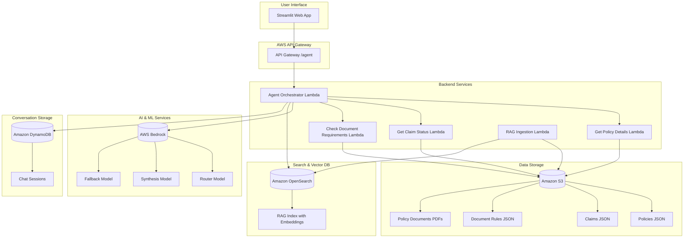
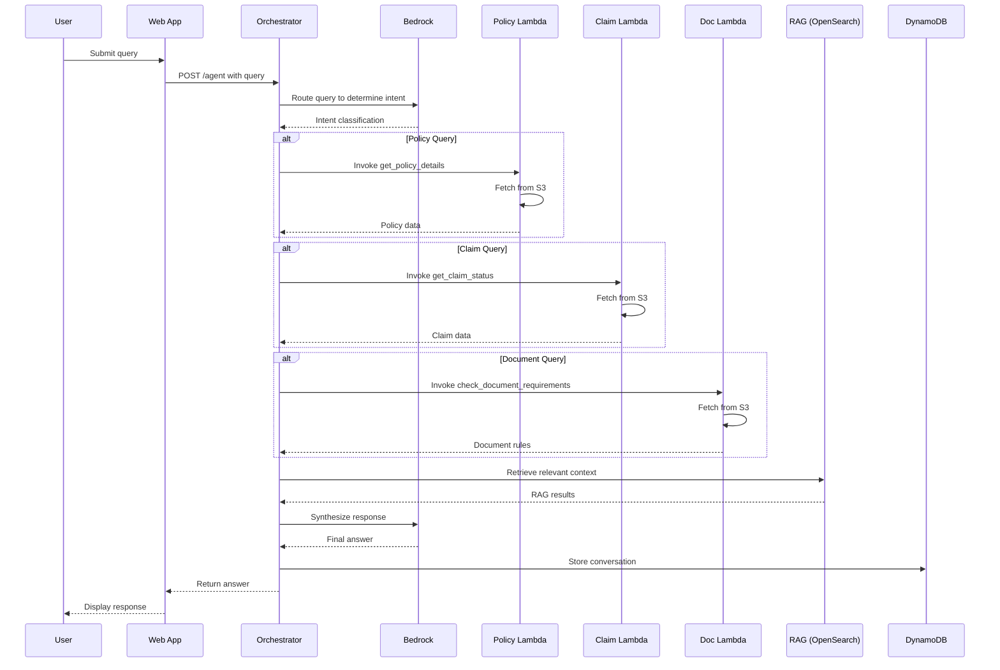

# 🤖 NorthStar Insurance — AI Claims Assistant

This repository is a polished prototype for an AI-driven insurance claims assistant. It demonstrates how to combine small serverless functions, a RAG ingestion pipeline, and a lightweight web interface to automate policy lookups, claim status checks, and document requirement validation.

Audience: product managers, technical leads, and engineers evaluating a prototype for automated claims processing.

Business benefits:
- Reduced manual review time through automated checks and contextual answers
- Faster policy/claim lookup with retrieval-augmented responses
- Auditability via structured logs and stored conversations

## What’s included
- `Lambda_functions/` — serverless function code and SAM templates
- `Web_interface/` — demo UI (Streamlit) and Dockerfile
- `Database_Generation/` — synthetic data generator and sample claim files
- `Implementation_Doc/` — design and orchestration notes

## High-level Architecture

The system routes user queries to a lightweight orchestrator that invokes specialized functions (policy lookup, claim status, document checks) and enriches responses using a RAG index and LLM synthesis. The diagrams below show the system components and the end-to-end query flow.

### System Architecture Diagram



### Query Processing Flow



## Technology Snapshot

- Backend: AWS Lambda, API Gateway, SAM
- Storage: S3 (documents), DynamoDB (conversations)
- Search: OpenSearch with embedding-based RAG index
- AI: Amazon Bedrock (router + synthesis models) and embeddings
- Frontend: Streamlit demo app (Web_interface)

## Quickstart (Developer)

Prerequisites: Python 3.10+, pip, optional Docker for container runs.

1) Create virtual environment and install web dependencies

```powershell
python -m venv .venv
.\.venv\Scripts\Activate.ps1
pip install -r Web_interface/requirements.txt
```

2) Run the web demo locally

```powershell
cd Web_interface
python app.py
# Open http://localhost:8000 (or port printed by the app)
```

3) Run an individual function for testing

```powershell
cd Lambda_functions/check_document_requirements
python app.py
```

Notes:
- Many functions include a small `app.py` for local testing; install any `requirements.txt` in the function folder before running.
- Synthetic data is in `Database_Generation/data/` and can be regenerated with `Database_Generation/generate_data.py`.

## Deployment Guidance (Production Considerations)

- Replace local JSON files with secure data stores (S3, managed DB)
- Use a secrets manager for model and API keys
- Add authentication and RBAC for the web UI and APIs
- Implement monitoring and structured logging for audit trails
- Harden the RAG pipeline: provenance, answer attribution, and human-in-the-loop review

## Project Layout

```
Database_Generation/      # Synthetic data generation
Lambda_functions/         # Serverless handlers and SAM template
Web_interface/            # Streamlit demo and Dockerfile
Implementation_Doc/       # Architecture and design notes
requirements.txt          # Optional project-level deps
.env                      # Local environment variables (not checked in)
```

## Contributing

Preferred workflow:
1. Fork the repo, create a feature branch
2. Add focused unit tests for new behavior
3. Open a pull request with a short description and testing steps

## Contact

Open an issue in the repository with feature requests or questions, or contact the project owner for product discussions.

---

If you want, I can:
- Add a minimal CI workflow to run tests on PRs
- Create a `Makefile` or task runner for common developer flows
- Produce cloud-specific deployment instructions (AWS / Azure)


### Web Interface

1. Start the Streamlit application:

```bash
cd Web_interface
streamlit run app.py
```

2. Open your browser to `http://localhost:8501`
3. Start chatting with the insurance agent

### API Usage

The agent exposes a REST API endpoint:

```bash
curl -X POST https://your-api-gateway-url/Prod/agent \
  -H "Content-Type: application/json" \
  -d '{
    "query": "What is the status of claim CLM-003C7AFB?",
    "session_id": "optional-session-id"
  }'
```

**Response Format:**
```json
{
  "answer": "Claim CLM-003C7AFB is currently submitted with an estimated damage of $14,089.",
  "session_id": "generated-or-provided-session-id"
}
```

### Sample Queries

The agent can handle various types of insurance-related queries:

- **Policy Information**: "Show me the details for policy AUTO-10019"
- **Claim Status**: "What's the status of my claim CLM-003C7AFB?"
- **Document Requirements**: "What documents do I need for a car collision claim?"
- **Coverage Questions**: "Does my home policy cover water damage?"
- **General Assistance**: "How do I file a new claim?"

## 🔄 Data Flow

1. **User Query**: Submitted through web interface or API
2. **Intent Classification**: Router model determines query type
3. **Data Retrieval**: Specialized Lambda functions fetch relevant data from S3
4. **Context Enhancement**: RAG system retrieves related information from policy documents
5. **Response Synthesis**: Synthesis model generates natural language response
6. **Conversation Storage**: Chat history saved to DynamoDB for continuity

## 🧪 Testing

### Local Testing

```bash
# Test Lambda functions locally
cd Lambda_functions
sam local invoke AgentOrchestratorFunction -e event.json

# Test web interface
cd Web_interface
python -m streamlit run app.py --server.port 8501
```

### Unit Tests

```bash
# Run tests (if implemented)
pytest tests/
```

## 🚀 Deployment

### CI/CD Pipeline

The project includes GitHub Actions for automated deployment:

1. **Build**: Install dependencies and build SAM application
2. **Test**: Run unit tests and integration tests
3. **Deploy**: Deploy to AWS using SAM CLI
4. **Data Upload**: Upload generated data to S3
5. **RAG Ingestion**: Process documents for vector search

### Manual Deployment

```bash
# Deploy infrastructure
cd Lambda_functions
sam deploy --parameter-overrides \
  BucketName=your-bucket \
  ClaimsPrefix=claims \
  InsuranceDataPrefix=data

# Upload data to S3
aws s3 cp Database_Generation/data/ s3://your-bucket/data/ --recursive

# Deploy web interface
cd Web_interface
docker build -t northstar-web .
docker run -p 8501:8501 northstar-web
```

## 📊 Monitoring & Logging

### AWS CloudWatch

- Lambda function logs and metrics
- API Gateway access logs
- Custom metrics for agent performance

### Key Metrics

- Query response time
- Model invocation success rate
- RAG retrieval accuracy
- User conversation length

## 🔒 Security

### AWS Security Best Practices

- **IAM Roles**: Least-privilege access for all services
- **VPC Configuration**: Network isolation for sensitive data
- **Encryption**: Data encrypted at rest and in transit
- **API Authentication**: API Gateway with proper authentication
- **Secrets Management**: AWS Secrets Manager for sensitive credentials

### Data Privacy

- Customer PII handled according to insurance regulations
- Data anonymization for synthetic data generation
- Secure data transmission protocols

## 🤝 Contributing

1. Fork the repository
2. Create a feature branch (`git checkout -b feature/amazing-feature`)
3. Commit your changes (`git commit -m 'Add amazing feature'`)
4. Push to the branch (`git push origin feature/amazing-feature`)
5. Open a Pull Request

### Development Guidelines

- Follow PEP 8 style guidelines
- Add unit tests for new features
- Update documentation for API changes
- Ensure all tests pass before submitting PR

## 📝 License

This project is licensed under the MIT License - see the [LICENSE](LICENSE) file for details.

## 🙏 Acknowledgments

- AWS for providing the serverless infrastructure
- Anthropic for Claude models via Amazon Bedrock
- Streamlit for the web application framework
- Open source community for various Python libraries

## 📞 Support

For support and questions:

- Create an issue in the GitHub repository
- Contact the development team
- Check the documentation for common solutions

---

**NorthStar Insurance AI Agent** - Revolutionizing insurance customer service with AI-powered assistance.